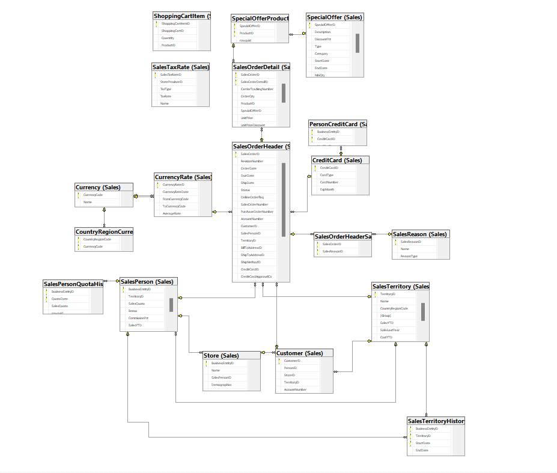
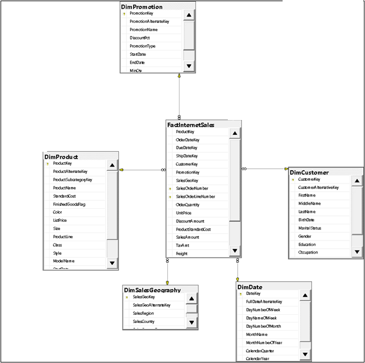
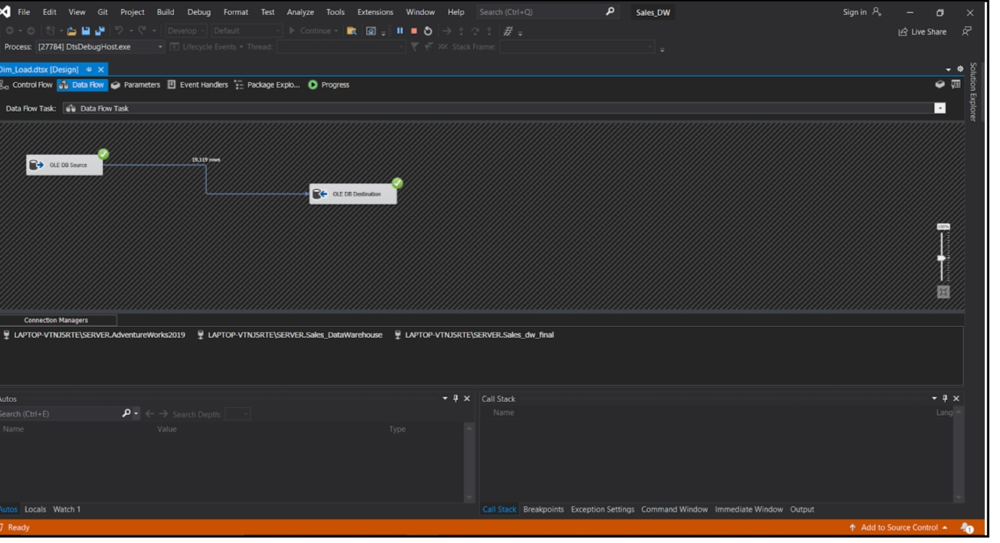
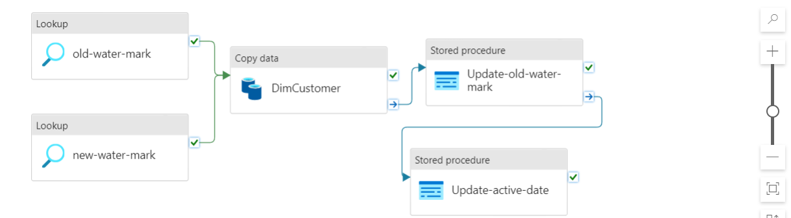
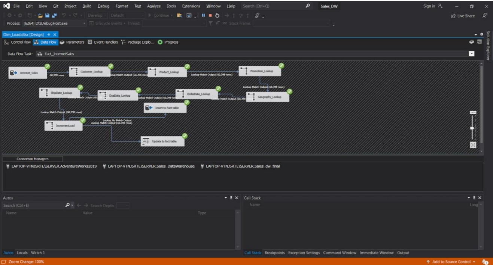
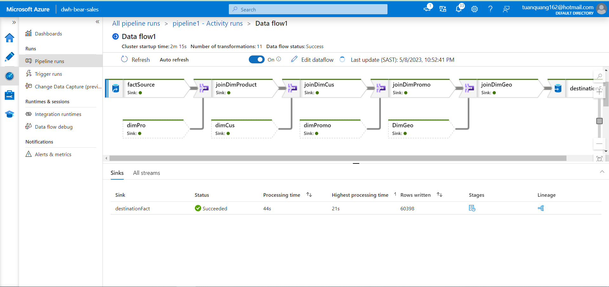
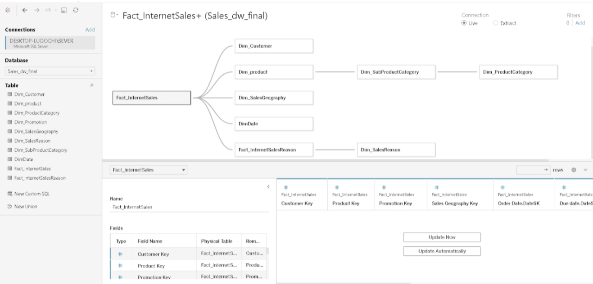
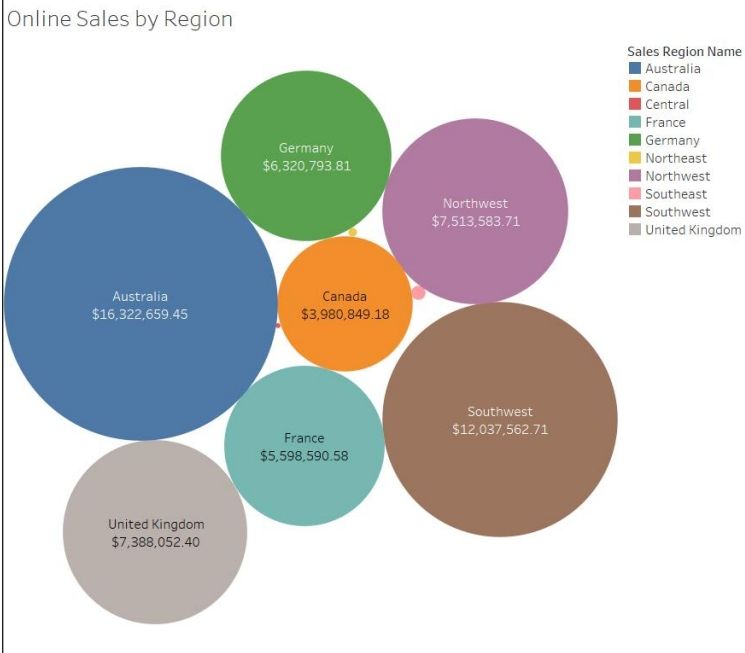
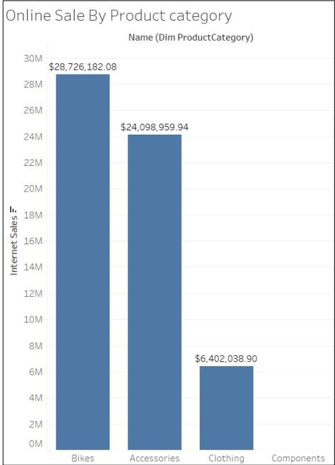

# Sales-Data-Warehouse-Development
Data Warehouse project analyzing AdventureWorks sales data, featuring Star Schema design, ETL pipelines, and visualization."
## Overview

This project aims to design and implement a Data Warehouse solution for analyzing sales data using the ([AdventureWorks](https://dataedo.com/download/AdventureWorks.pdf)) database provided by Microsoft. The primary objective is to explore and analyze sales transactions to derive meaningful insights for decision-making purposes.

## Data Warehouse Design

### Overview

The Data Warehouse follows a Star Schema design, comprising dimension and fact tables tailored specifically for analyzing sales data.

### Schema of Data Source

### Fact Table

The `FactInternetSales` table tracks internet sales transactions, capturing product, customer, and order details, along with pricing, discounts, and shipping costs. It also records key dates such as order, due, and ship dates for detailed sales analysis.

### Dimension Tables

- `DimCustomer`: Contains comprehensive customer details, including personal information, education, and occupation. It tracks employment periods and data usage status.
- `DimDate`: Manages detailed date information with day, month, and year identifiers, including names and numerical indexes.
- `DimGeography`: Stores geographical data such as city, state, country names and codes, and postal codes.
- `DimProduct`: Records product details like name, cost, sales attributes, and availability dates.
- `DimPromotion`: Catalogs promotions with details on discount rates, types, duration, and constraints.

## ETL Process
The ETL (Extract, Transform, Load) process is crucial for populating the Data Warehouse with relevant data from the source system.
After designing the DataWarehouse for the Sales module, in this part I use two tools at the same time including SSIS and Azure Data Factory (ADF) to develop an ETL pipeline to transfer data from Source to Destination in a standard way.
### ETL Pipeline

- Developed ETL pipeline with Incremental Loading to automate processes and minimize data duplication.
- Implemented ETL pipeline using **SQL Server Integration Services (SSIS)** for on-premises data integration and **Azure Data Factory** for cloud-based integration.

#### Dimtable ETL Illustration
Demonstrate ETL pipeline design on both SSIS and ADF tools

- SSIS: 
- Azure Data Factory: 

#### Fact Table ETL Illustration

- SSIS: 
- Azure Data Factory: 

## Data Analysis

### Overview

Data analysis is performed using Tablea uto visualize and explore insights derived from the Data Warehouse.

### Chart Visualization Results: 
-  Connect to Datawarehouse using Tableau: 
-  Online Sales by Region: 
-  Online Sale By Product category: 
